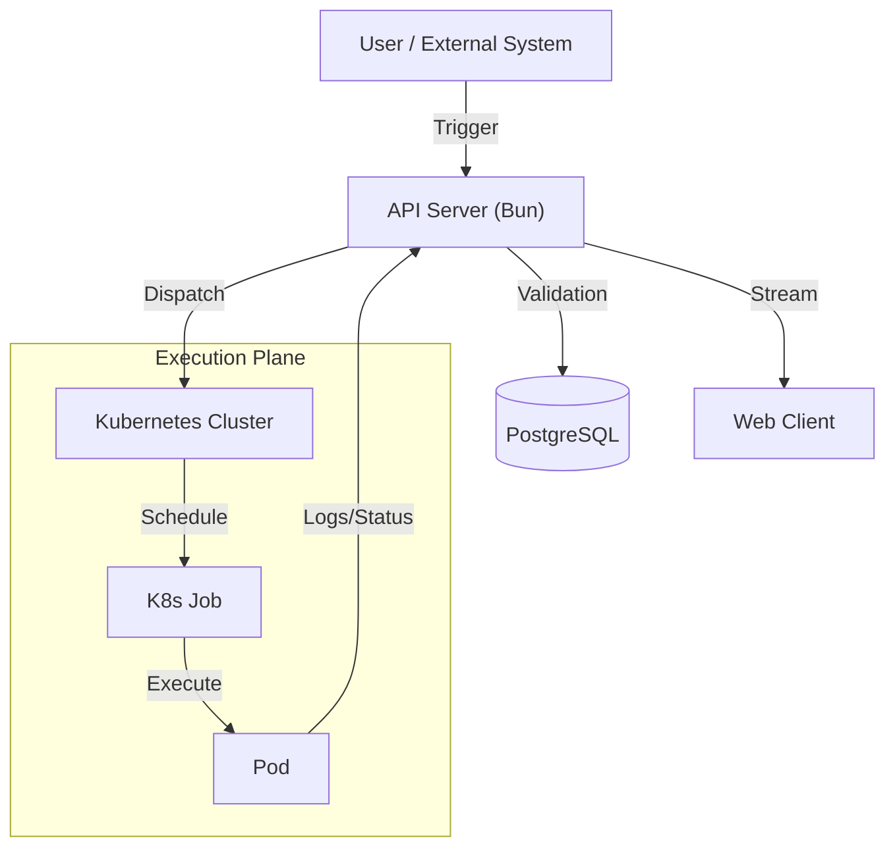

# System Architecture

The Workflow Execution System is designed for scalability, reliability, and security. It leverages Kubernetes for orchestration and an event-driven architecture for state management.

## High-Level Overview

## Key Components

### 1. API Server (Bun)

- **Role**: The central control plane.
- **Responsibilities**:
  - Receives workflow execution requests.
  - Validates workflow definitions.
  - Manages persistent state using Event Sourcing.
  - Exposes a WebSocket endpoint for real-time log streaming.

### 2. Execution Engine (Kubernetes)

- **Role**: The heavy lifter.
- **Mechanism**: Each workflow step is translated into a Kubernetes Job.
- **Benefits**:
  - **Isolation**: Steps run in separate containers, preventing cross-contamination.
  - **Scalability**: Leverage K8s cluster capabilities to run thousands of concurrent steps.
  - **Resilience**: K8s handles pod restarts and node failures automatically.
